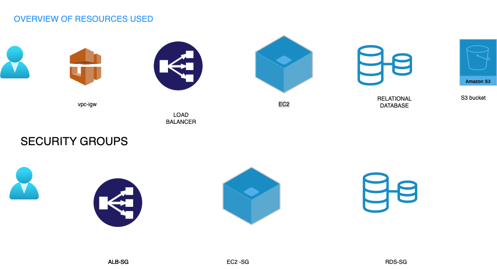

# 📑 Table of Contents:

1. [🚀 Project Overview](#project-overview)
2. [🖼️ Architecture Diagram](#architecture-diagram)
3. [🧰 Architectural Design Rationale](#overview-of-used-aws-services)
4. [⚙️ Terraform Configuration Overview](#terraform-configuration-overview)
5. [🏗️ Infrastructure Components](#infrastructure-components)
   - [🌐 VPC](#vpc)
   - [🛡️ Security Groups](#security-groups)
   - [🖥️ EC2 Launch Template](#ec2-launch-template)
   - [⚖️ Application Load Balancer (ALB)](#application-load-balancer-alb)
   - [💾 Amazon RDS](#amazon-rds)
   - [🗂️ S3 Bucket](#s3-bucket)
   - [🔐 IAM Roles for EC2](#iam-roles-for-ec2)
   - [🔐AWS Secrets Manager](#aws-secrets-manager) 
6.  [🔐 Security Considerations](#securtity-considerations)
7. [🚀 CI/CD Pipeline with GitHub Actions](#cicdpipelines-githubactions)
8. [🧩 Understanding GitHub Actions Strategy](#githubaction-strategy)
9. [🚧 Future Developments](#furture-developments)
10. [🚀 Step-by-Step Deployment Guide](#step-by-developments)
  
---
 ## 🚀 Project Overview:

This project is part of the Cloud Track in our Software Engineering bootcamp at Masterschool. The application was originally developed by Alejandro Román, our Track Mentor (A big Thanks to him!). Our task was to design and deploy its AWS infrastructure step by step, implementing each component individually.


 ### 🌐 AWS Services Used:
- 🖥️ **EC2 Instance**: Deployed virtual servers to run the application.
- 🏢 **Application Load Balancer (ALB)**: Ensured high availability and traffic distribution across instances.
- 💾 **RDS (Relational Database Service)**: Managed and scaled the database with ease.
- 🗂️ **S3 Bucket**: Stored and managed static files for the application.
- 🛡️ **IAM Roles**: Configured and attached IAM roles to securely manage permissions and access control for various AWS resources.

The objective was to architect and deploy a resilient, highly available, and secure infrastructure, following Infrastructure as Code (IaC) principles and AWS best practices. Every component was provisioned, configured, and integrated through Terraform — ensuring consistency, repeatability, and version-controlled deployments.
For details about the application's features, functionality, and local installation, refer to the original README.md by Alejandro.

---

 ### 2. 🖼️ Architecture Diagram:
  
---
## 📌 Architectural Design Rationale:

### 🖥️ **Amazon EC2 (Elastic Compute Cloud):**
   - Chosen over alternatives like App Runner, Lambda, and ECS for
   - Full control over the operating system, networking, and runtime environment.
   - Simplified deployment suitable for early-stage infrastructure learners.

### 🌐 **Application Load Balancer (ALB):**
   - Implemented for Storing static files like images and assets in a scalable, durable, and cost-effective way.

### 💾 **Amazon RDS (Relational Database Service):**
   - Selected instead of DynamoDB or Aurora Serverless because:
   - The application relies on a relational schema with structured relationships.
   - RDS offers automated backups, encryption, and multi-AZ failover with minimal operational overhead.

### 🗂️ **Amazon S3 (Simple Storage Service):**
   - Amazon S3 was used for static asset storage, ensuring cost-effective, durable, and highly available object storage.

### ⚙️ **Terraform (Infrastructure as Code):**
   - Terraform was adopted as the Infrastructure as Code (IaC) tool to provision and manage cloud infrastructure in a scalable, automated, and version-controlled manner.

---
## 4. ⚙️ Terraform Configuration Overview:

   ```bash
terraform/
├── main.tf                 # Root module wiring all other modules
├── variables.tf            # Input variables
├── outputs.tf              # Output values from root module
├── terraform.tfvars        # Variable values used during plan/apply
└── modules/
    ├── alb/                    # Application Load Balancer configuration
    ├── security_groups/        # Security group rules for ALB, EC2, RDS
    ├── ec2_launch_template/    # EC2 instance setup and Auto Scaling
    ├── rds/                    # Amazon RDS (PostgreSQL/MySQL) database
    ├── s3_bucket/              # S3 bucket for static files
    ├── vpc/                    # VPC, subnets, IGW, route tables, etc.
    └── iam_roles_ec2/         # IAM role and policy for EC2 to access S3


   ```
---

## 5. 🏗️ Infrastructure Components:

### 🌐 VPC Module

- **📁 Location:** `modules/vpc`  
- **📝 Description:**  
  Defines the **Virtual Private Cloud (VPC)** and associated networking resources including subnets, internet gateway, and route tables. This sets up the foundational network layer for your AWS infrastructure.

- **🔑 Key Terraform Resources:**
  - `aws_vpc`
  - `aws_subnet`
  - `aws_internet_gateway`
  - `aws_route_table`
  - `aws_route_table_association`
---

### 🛡️ Security Groups

- **📁 Location:** `modules/security_groups`

- **📝 Description:**
  Creates security groups for EC2, RDS, and ALB to control inbound/outbound traffic.

- **🔑 Key Terraform Resources:**

   - `aws_security_group`
   - `aws_security_group_rule`

---
###  🖥️ EC2 Launch Template

- **📁 Location:** `ec2_launch_template`  
- **📝 Description:**  
  Configures EC2 launch template with AMI, instance type, and user data script.


- **🔑 Key Terraform Resources:**
  - `aws_launch_template`
  - `aws_autoscaling_group`

---
###  🌐 Application Load Balancer (ALB)

- **📁 Location:** `modules/alb`  
- **📝 Description:**  
  Sets up an ALB to distribute traffic across EC2 instances.


- **🔑 Key Terraform Resources:**
  - `aws_lb`
  - `aws_lb_target_group`
  - `aws_lb_listener`

---
###  💾 RDS

- **📁 Location:** `modules/rds`  
- **📝 Description:**  
  Sets up an ALB to distribute traffic across EC2 instances.


- **🔑 Key Terraform Resources:**
  - `aws_db_instance`
  - `aws_db_subnet_group`
---

###  💾 S3 Bucket

- **📁 Location:** `modules/s3_bucket`  
- **📝 Description:**  
  Sets up an ALB to distribute traffic across EC2 instances.


- **🔑 Key Terraform Resources:**
  - `aws_s3_bucket`
  - `aws_db_subnet_group`
---
###  🔐 IAM Roles for EC2

- **📁 Location:** `modules/iam_roles_ec2`  
- **📝 Description:**  
  Creates an IAM role and instance profile for EC2 instances, granting them permissions to access a specific S3 bucket or folder path within the bucket.


- **🔑 Key Terraform Resources:**
  - `aws_iam_role`
  - `aws_iam_policy`
  - `aws_iam_role_policy_attachment`
  - `aws_iam_instance_profile`
---
### 🔐 AWS Secrets Manager

- **📁 Location:** `modules/aws_secrets_manager`  
- **📝 Description:**  
  Manages sensitive data like database credentials or API keys securely using AWS Secrets Manager. This module creates and stores secrets, allowing secure access by applications or services without hardcoding sensitive values.
- - **🔑 Key Terraform Resources:**
  - `aws_secretsmanager_secret`
  - `aws_secretsmanager_secret_version`

---
###  ⚙️ Root Module

- **📁 Location:** `Root directory (main.tf, variables.tf, outputs.tf, terraform.tfvars)`  
- **📝 Description:**  
  Integrates all individual modules and manages global variables, outputs, and backend config.
-  **Purpose:**
   Serves as the central orchestrator for Terraform execution.
---

## 6. 🔐 Security Considerations:
- Security was integrated into each layer of the infrastructure, following AWS security best practices and the principle of least privilege.

### 🌐 VPC Module  and Subnets

- **📁 Location:** `modules/vpc`  
- **📝 Description:**  
  Custom VPC design isolates public-facing and private resources:
   - Public subnets host the Application Load Balancer (ALB) to handle inbound traffic.
   -  Private subnets host EC2 instances and RDS, isolating sensitive services from direct internet access.
---

### 🛡️ Security Groups

- **📁 Location:** `modules/security_groups`

- **📝 Description:**
  Security groups act as virtual firewalls to regulate traffic:
  - ALB Security Group: Allows inbound HTTP/HTTPS traffic from the internet.
  - EC2 Security Group: Accepts traffic exclusively from the ALB.
  - RDS Security Group: Permits traffic only from EC2 instances within private subnets.

---

###  🔐 IAM Roles for EC2

- **📁 Location:** `modules/iam_roles_ec2`  
- **📝 Description:**  
  Defines scoped IAM roles granting EC2 instances secure, temporary permissions:
  - Enables controlled access to AWS services such as S3.
  - Prevents hardcoding sensitive credentials within application code.

---
### 🔐 AWS Secrets Manager

- **📁 Location:** `modules/aws_secrets_manager`  
- **📝 Description:**  
  Manages sensitive data like database credentials securely:
  - Applications retrieve secrets programmatically at runtime.
  - Prevents embedding sensitive information in code or configuration files.
---
###  🔒 Encryption
- **📝 Description:**  
   Ensures data security at rest and in transit:
   - RDS storage and automated backups are encrypted at rest.
   - S3 bucket utilizes server-side encryption for all stored objects.
---

## 6. 🚀 CI/CD Pipeline with GitHub Actions
- To automate infrastructure provisioning and ensure consistency across environments, this project uses GitHub Actions for continuous integration and deployment (CI/CD). The CI/CD workflow is tailored to securely authenticate with AWS, generate environment-specific configurations, and run Terraform plans.

### 🔐 Secure AWS Access with OIDC and IAM Roles:
- Instead of using hardcoded AWS access keys or secrets in the pipeline, we use OIDC (OpenID Connect) to securely assume an IAM role directly from GitHub. This provides several key benefits:  
- **📝 Description:**  
  - Enhanced Security: No long-lived credentials are stored in GitHub — tokens are temporary and scoped.
  - Automatic Rotation: Tokens expire automatically, eliminating the need for manual key rotation.
  - Least Privilege Access: The IAM role has only the permissions required to run Terraform, minimizing the blast radius.
  - Tight Integration: GitHub’s native support for OIDC makes this setup seamless and cloud-native.
---
## 7. 🧩 Understanding Our GitHub Actions Strategy
- **📝 Description:**  
  During the GitHub Actions run:
  - The workflow authenticates to AWS using a role that trusts GitHub’s OIDC identity provider.
  - It dynamically generates a terraform.tfvars file by securely injecting values from GitHub Secrets. This includes whitelisted IPs, database credentials, AMI IDs, and more.
  - The Terraform CLI is then used to initialize the project and generate a plan using the configuration.
  - This design ensures that infrastructure deployments are secure, reproducible, and environmentally isolated, while still allowing dynamic configuration through centralized secrets' management.
  - By combining Infrastructure as Code (Terraform) with secure CI/CD practices, this setup aligns with modern DevOps and cloud security best practices.
---
## 8 🚧 Future Developments

While the current infrastructure is functional and secure, there are several enhancements planned to improve scalability, maintainability, and observability:

- **Add Monitoring & Logging** using AWS CloudWatch and centralized logging for EC2/RDS metrics.
- **Implement Auto-scaling Policies** for EC2 instances based on CPU/memory thresholds.
- **Add Blue/Green Deployment Support** via separate target groups in the ALB.
- **Enable GitHub Actions Terraform Apply** in a secure, gated manner (e.g., with manual approvals).
---

## 🚀 Step-by-Step Deployment Guide:
Follow these steps to clone the repository and deploy the Grocery App on AWS:

### Step 1: Create an AWS Account

- Sign up at AWS Sign-Up.
- Verify your email and complete the setup.  

---
### Step 2:  Create an IAM User and Access Keys
 
- Navigate to IAM > Users > Create User.
- Enable Programmatic Access.
- Attach these policies:
 - AmazonEC2FullAccess
 - AmazonRDSFullAccess
 - AmazonS3FullAccess
 - AmazonVPCFullAccess
 - IAMFullAccess
- Save your Access Key ID and Secret Access Key securely.
---
### Step 3: Install and Configure AWS CLI
 
- Install: AWS CLI Installation Guide
- Configure:
   - aws configure
- Provide your Access Key ID, Secret Access Key, and preferred AWS region (e.g., eu-central-1).
---
### Step 4: Create an SSH Key Pair
 
- Go to EC2 > Key Pairs > Create Key Pair.
- Format: .pem
- Save the .pem file securely for SSH access.
---
### Step 5: Clone the Repository
 
- git clone https://github.com/N123p/AWS_grocery_app.git
- cd AWS_grocery_app

---
### Step 6: Configure Terraform Variables

- Navigate to the infrastructure directory:
- cd infrastructure
- Edit terraform.tfvars with your configuration:
  - Region
  - DB Username/Password
  - S3 Bucket name (must be globally unique!)
  - SSH Key Pair name
  - Allowed SSH IP address
- (Optional) Existing AMI ID or RDS snapshot ID
---
### Step 7: Bootstrap Backend for Terraform State

- Initialize Terraform backend (S3 + DynamoDB locking):
  - terraform init
  - terraform apply
- This will set up your backend if it’s not already configured.
---
### Step 8: Setup GitHub Actions Secrets

- In your GitHub Repo:
- Navigate to Settings > Secrets and variables > Actions. init
- Add the following secrets:
  - AWS_ACCESS_KEY_ID
  - AWS_SECRET_ACCESS_KEY
  - TF_VAR_AMI_ID
  - TF_VAR_db_user
  - TF_VAR_db_password
  - TF_VAR_KEY_NAME
---

### Step 9: Deploy Infrastructure

- In your GitHub Repo:
- Push changes to the main branch.
- GitHub Actions will automatically:
  - Deploy the network (VPC, Subnets, Security Groups)
  - Launch the EC2 instances
  - Set up the RDS database
  - Configure the ALB
  - Deploy the backend and frontend applications.
---
### Step 10: Verify Deployment
- Access the app using the ALB DNS name (find in GitHub Actions output).
- SSH into EC2 (example):
  - ssh -i path/to/your-key.pem ec2-user@<EC2_PUBLIC_IP>
---
### Step 11: Destroy Resources (Teardown)
- Navigate to infrastructure/:
 - terraform destroy
- Confirm destruction by typing yes.
- If you created bootstrap resources separately, destroy them too.
---
### Step 12: (Optional) Deactivate GitHub Actions
- Go to Settings > Actions > General.
- Disable GitHub Actions if you want to stop automatic deployments.
---
